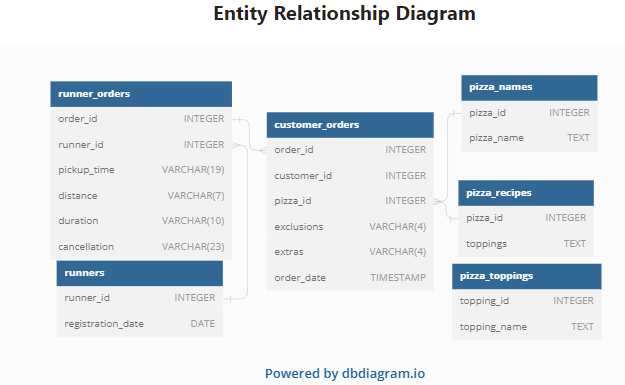

# 🍕Case Study #2 - Pizza Runner

## Table Of Contents

- [Entity Relationship Diagram](#entity-relationship-diagram)
- [Case Study Questions](#case-study-questions)
- [Solution](#solution)

## Entity Relationship Diagram

## Case Study Questions

This case study has LOTS of questions - they are broken up by area of focus including:

- Pizza Metrics
- Runner and Customer Experience
- Ingredient Optimisation
- Pricing and Ratings
- Bonus DML Challenges (DML = Data Manipulation Language)

## Solution

**PS: I made use of PostgreSQL db and dialect for this module.**

- [Pizza metric Solution](./pizza_metrics.ipynb)
- [Runner and Customer Experience Solution](./runner_customer.ipynb)
- [Ingredient Optimization](./ingredient_optimize.ipynb)
